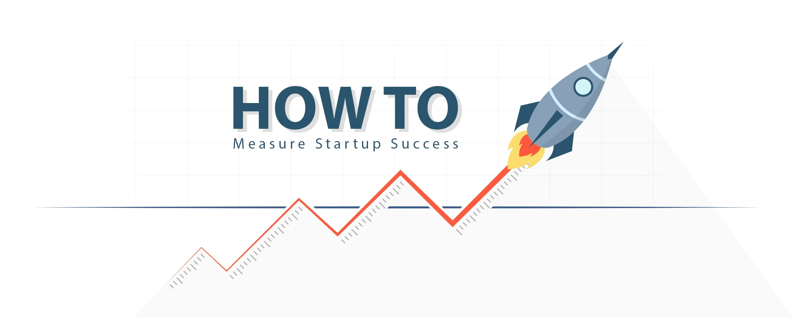

# Startup Success Prediction 🚀

A **Streamlit web application** that predicts the probability of a startup succeeding or failing using a trained XGBoost machine learning model.

<p align="center">
  <a href="https://startupssuccessprediction.streamlit.app/">
    
  </a>
</p>

This tool helps entrepreneurs, investors, and venture capitalists assess startup potential early by analyzing key features like location, funding history, milestones, industry category, and team relationships.

Built on real-world data from Crunchbase (via Kaggle), the model achieves **~81% accuracy** and provides probabilistic predictions even with partial information.

## Live Demo (if deployed)
*(Add your deployed link here, e.g., Streamlit Community Cloud, Heroku, etc.)*

## Features

- **Interactive Prediction Interface** – Enter startup details and get instant success probability
- **Handles Missing Data Gracefully** – Works even if some information is unknown (with warnings)
- **Smart Defaults** – Uses most common/mode values from training data when user selects "others" or leaves fields blank
- **User-Friendly Design** – Clean UI with progress bar, color-coded results, and helpful guidance
- **Two Pages**:
  - **Home Page**: Make predictions
  - **About Project**: Detailed explanation, dataset info, and links

## Screenshots



## How It Works

The app uses a pre-trained **XGBoost classifier** trained on historical startup data to predict whether a startup will **succeed (acquired or operating)** or **fail (closed)**.

Key input features include:
- Location (city, state, zip code, latitude/longitude)
- Founding and funding dates
- Number of funding rounds and total funding (USD)
- Industry category
- Milestones and relationships
- Whether it's in the top 500

The model outputs:
- Probability of success
- Probability of failure
- Final verdict: **"Startup will succeed"** or **"Startup will fail"**

> Note: Predictions are most accurate when **at least 9 out of 18 features** are provided.

## Project Structure

```
.
├── startup.py                  # Main Streamlit application
├── startup.csv                 # Cleaned dataset used for encoding and defaults
├── model                       # Pickled XGBoost model (binary file)
├── requirements.txt            # Python dependencies
├── startups-success-prediction.ipynb  # Jupyter notebook with EDA, preprocessing & training
├── How-to-Measure-Startup-Success-Main.jpg  # Banner image
├── logo.png                    # App logo
├── .gitignore
├── .devcontainer               # Dev container config (optional)
└── README.md
```

## Dataset

- Source: [Startup Success Prediction - Kaggle](https://www.kaggle.com/datasets/manishkc06/startup-success-prediction)
- Original data scraped from Crunchbase
- Target: `status` → mapped to success (acquired/operating) vs failure (closed)
- Features engineered: age at funding/milestones, location encoding, binary indicators

## Installation & Running Locally

### 1. Clone the repository
```bash
git clone https://github.com/yourusername/startup-success-prediction.git
cd startup-success-prediction
```

### 2. (Recommended) Create a virtual environment
```bash
python -m venv venv
source venv/bin/activate    # On Windows: venv\Scripts\activate
```

### 3. Install dependencies
```bash
pip install -r requirements.txt
```

### 4. Run the app
```bash
streamlit run startup.py
```

The app will open in your browser at `http://localhost:8501`

## requirements.txt

```txt
streamlit>=1.32.0
xgboost>=2.0.0
scikit-learn>=1.3.0
pandas>=2.0.0
numpy>=1.24.0
```

## Model Details

- Algorithm: **XGBoost Classifier**
- Trained on cleaned Crunchbase startup dataset
- Features: 18 engineered inputs (dates → age features, categorical → label encoded)
- Output: Probability scores via `predict_proba`
- Saved using `pickle`

## Contributing

Contributions are welcome! Feel free to:
- Improve UI/UX
- Add more features (e.g., confidence intervals, feature importance)
- Support file upload for batch predictions
- Deploy improvements

Submit a pull request or open an issue.

## Links

- Training Notebook: [Kaggle Notebook](https://www.kaggle.com/code/sundayabraham/startups-success-prediction)
- Dataset: [Kaggle](https://www.kaggle.com/datasets/manishkc06/startup-success-prediction)
- GitHub Repo: [https://github.com/AgabaEmbedded/ML-Hackathon](https://github.com/AgabaEmbedded/ML-Hackathon)

## Disclaimer

This tool provides probabilistic estimates based on historical patterns and should **not** be used as the sole basis for investment decisions. Startup success depends on many dynamic and unquantifiable factors.

---

Made with ❤️ for the startup ecosystem

**Predict smarter. Invest wiser.** 🚀
